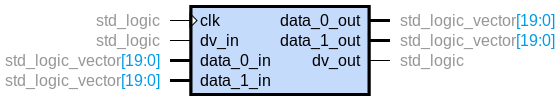

# Integration

## Schemas

## Mode 1: sine-cosine

| Port name  | Type                  | Description    |
| ---------- | ----------------------| -------------- |
| clk        | std_logic             | clock          |
| dv_in      | std_logic             | data valid in  |
| data_0_in  | Q2.17 format [-pi,pi] | Radians angle  |
| data_1_in  | --                    | --             |
| data_0_out | Q2.17 format          | sine           |
| data_1_out | Q2.17 format          | cosine         |
| dv_out     | std_logic             | data vaild out |

## Mode 2: arctg-magnitude

| Port name  | Type                  | Description     |
| ---------- | ----------------------| --------------- |
| clk        | std_logic             | clock           |
| dv_in      | std_logic             | data valid in   |
| data_0_in  | Q2.17 format [-1,1]   | x               |
| data_1_in  | Q2.17 format [-1,1]   | y               |
| data_0_out | Q2.17 format          | arctg(y/x)      |
| data_1_out | Q2.17 format          | sqrt(x^2 + y^2) |
| dv_out     | std_logic             | data vaild out  |

## Todo

- Include reset.

## Resources utilization

## Common errors
